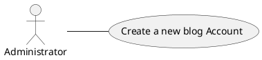
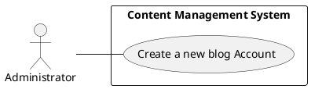
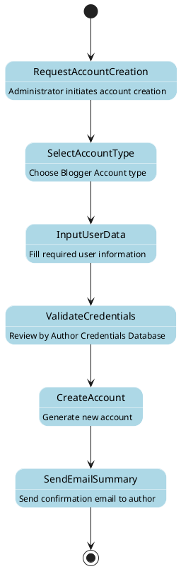
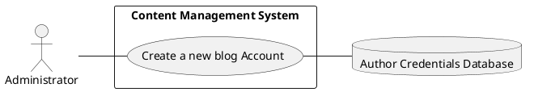
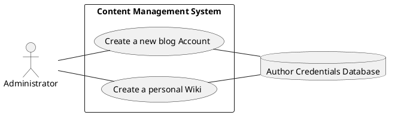
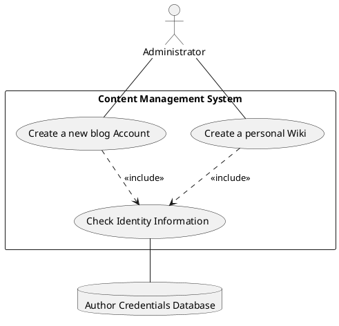

# Class #4 — Software Design — Wednesday Jan 22th

> The present file will contain information pertaining to the continuation of the Introduction to Software Design 
> series. If it's a new presentation, its contents will be appended here, if not, expect this file to 
> remain empty until new content is taught.

## Use Case Analysis — A Closer look

Although we have defined in the first section of this unit what were use cases, how to think 
about use cases, and specially what they should contain (we will write a short review on this 
soon. The content of this page will expand upon use cases, delving deep into its modeling, 
execution, utilization, etc.

<tldr>
<i>From our last article:</i> Use cases define, in general terms, the way we 
think the user will interact with the system. These define paths and procedures that the 
user would follow in normal, average, and worst-case scenarios, and define expected 
outcomes for a programmer to prepare their system for.
  
Effectivbely then, use cases define the relationships between one component of our domain model 
and goals and results expected from our implementation, <code>actors (defined as often external 
users), 
goals (often defined as what we want to achieve), and scenarios (defined as the 
process or steps needed for the actor and the system to achieve the goal)</code>
</tldr>

### Use Case Analysis — What Are Use Cases?

They are defined as a <b><i><code>situation through which one or more functional requirements are 
tested to see if they are satisfied by our system</code></i></b>. These show <code>what the system must do</code>, 
not exactly what how it should do, or does it. Effectively we do not use <i>non-functional requirements here</i>
  
Use cases, have three main characteristics to show that they are useful.

<deflist type="wide">
<def title="Use Cases — Key Characteristics">
<list columns="1" type="alpha-lower">
<li>
<b><format color="CornFlowerBlue">Clear Value</format></b>: each use case should showcase 
clearly the value of the functionality tested for the overall system.
</li>

<li><b><format color="CornFlowerBlue">Start and End</format></b>: each use case has a start and 
end points clearly defined in their textual description. </li>

<li><b><format color="CornFlowerBlue">External initializer</format></b>: often, use cases start 
by an <b><code>actor that is outside the system</code> (a person or another system)</b> </li> 
</list>
</def>
</deflist>

### Use Case Analysis — Examples of Use Case Definitions

Both in this section and the previous we have explained what a use case should include 
<b><code>(actors, goals, scenarios) (i.e., actors, outcomes, procedures)</code></b>. And we have 
also discussed its value <b><code>show what the system must do, not how, and allow us to refine 
our domain model, ergo, our implementation)
</code></b>, characteristics <b><code>(start and end, clear value, external actor)</code></b>, 
now it is time for us to take a look at some use cases definitions, and analyze their inputs and 
values.

<procedure type="choices" title="Use Case Definition — Examples" collapsible="true">
<tabs>
<tab title="Example One — Blog Handler App">

The following is the text from the example

 

- Nombre: Requerimiento A.1
- El sistema de manejo de contenido tiene que permitir que un administrador cree una cuenta de
  blog si todos los detalles del nuevo Blogger están verificados usando la base de datos de
  credenciales de autores.
</tab>
</tabs>
</procedure>

Through this example we can see how there are various components that are textually described 
and all help to get to an end (create the new blogger account). The idea here is to notice that 
<code>in terms of use cases</code>, we should always define <i>entities and their interaction with 
our system</i>. in the aforementioned example these would be any and all administrators who will 
allow new Blogger accounts.
  
We should also be quick and efficient at finding the <code>functionality that our system 
should provide to those entities</code> (in our case creating an account). Moreover, as we have 
discussed earlier, a system is not only made up of internal software components, but also 
external information and interaction like <code>user inputs</code>. For this reason, we should 
be able to determine (through a use case description) <i><b><code>what is within and 
outside our system, as well as what output should the system produce and return to 
the user</code></b></i>
  
One keyword, though, that we have been ignoring is the Actors keyword (also known as Entity). 
which is the topic of the next subsection.

#### Use Case Definitions — Actors (Entities)

An entity <b><code>(actors)</code></b>, are outside entities from our system, components that 
are not managed like our software (these could be, as we know, both users and external software).
These often have <code>well defined boundaries and are known for being separated from the 
core of our system design (e.g., a user is not directly a part of our system design, but is 
accounted for by virtue of its future interaction with it)</code>
  
Actors in software design, specially when it comes to use cases have a set of characteristics 
that define them.

<deflist type="wide">
<def title="Entities (Actors) — Key Characteristics">
<list>
<li><b><format color="CornFlowerBlue">Naming conventions</format></b>: we should make sure 
that naming-wise these are <b><code>familiar (vocabulary-wise) for all users and 
designers in our system</code></b></li>
<li><b><format color="CornFlowerBlue">Where do they, often, reside?</format></b>: actors often 
reside outside of our system </li>
<li><b><format color="CornFlowerBlue">Are they modifiable?</format></b>: actors are often 
non-modifiable, acting like a blackbox, of which we are only interested so long as they 
interact with our system</li> 
<li><b><format color="CornFlowerBlue">Classifications</format></b>: actors are not just those 
who interact with our systems in the user-wise sense. These could also be maintainers, 
developers, auditors, etc. </li> 
</list>
</def>
</deflist>

For this reason <format style="bold" color="Orange">we should always think of our 
actors, their interrelations, and the relationship of them and our software product</format>

### Use Case Analysis — How to find/define Use Cases?

In our domain model, we often identify actors and we keep them on a separate list, like a 
stake-holder list of possible firsthand and secondhand users of our software 
<b><code>we must iterate over each actor to attempt to find situations in which the 
system is used to achieve something for them</code></b>
  
As a little sidenote
 
<note><i>From the actor's point of view, a complete system 
interaction will, or should always produce some kind of result (product)
</i></note>

 Therefore it becomes quite important for us to create measurable 
use cases for 
each type of user we might have.

The overarching process of defining and finding use cases boils down to four steps that we 
will be covering most ardently in this inner definition list.

<procedure type="steps">
<step>
<deflist type="full" collapsible="true">
<def title="Choose a System Boundary">

A system boundary is a delimiter <i><code>of our system, of its internal aspects 
with respect to external actors or forces</code></i>. An example of this could be that databases,
APIs, and even users are considered external to our system, while interfaces and classes within 
are internal

Some questions to guide us in this discovery might be

<list> 
<li><format color="CornflowerBlue">Is it just a software application, the hardware 
and application as a unit, that plus a person using it, or an entire organization?</format></li>
<li><format color="CornflowerBlue">What are some of the actors I expect to interact with my system?</format></li>
</list>

Using the last question is key as in some cases <i><b><code>a system boundary 
can be clarified when defining the external primary and supporting actors, rather than the other 
way around.
</code></b></i>

</def>
</deflist>
</step>
<step>
<deflist type="full" collapsible="true">
<def title="Identify Primary Actors">

Actors are those that interact with our system, often external and unchangeable on our end. 
Primary actors are those that interact the most with our system, and are those that expect some 
outcome from our use cases. Defining these can be though, specially when we might want to define 
use cases before addressing them. For this reason, <i><code>it is often recommended that 
we brainstorm primary actors first as they define a framework for defining use cases</code></i>

To help us with this, the following questions can be reviewed (additionally questions can be 
found on Craig lagman page 151 (pdf page) Applying UML and Patterns. Moreover, explanations to 
the key actors that can arise from these questions can be found <a 
href="Class-1-Software-Design-Monday-Jan-13th.md"> here</a>, on the topic of requirements, a 
closer look, finding actors.

<list columns="2">
<li><b><format color="CornFlowerBlue">Who is interested in the system?</format></b></li>
<li><b><format color="CornFlowerBlue">Who is likely to use the system?</format></b></li>
<li><b><format color="CornFlowerBlue">Who will benefit from the system?</format></b></li>
<li><b><format color="CornFlowerBlue">Who will supply information to the system?</format></b></li>
<li><b><format color="CornFlowerBlue">Who will maintain information in the system?</format></b></li>
<li><b><format color="CornFlowerBlue">Where in the organization is the system to be used?
</format></b></li>
<li><b><format color="CornFlowerBlue">Who manages system security?</format></b></li>
<li><b><format color="CornFlowerBlue">Who handles system failures?</format></b></li>
<li><b><format color="CornFlowerBlue">Who provides training and documentation?</format></b></li>
</list>
</def>
</deflist>
</step>
<step>
<deflist type="full" collapsible="true">
<def title="Identify Goals for Each Primary Actor">

Additionally, there are some ways in which we can group and form use cases based on the 
actors that we have identified, these can be <b><code>drawing UML usecase diagrams as soon as we 
have found an actor and improving from here, or creating an actor-goal list that helps us define 
goals to refine and represent
</code></b>

Usage of both depends on the desired depth that we want to have in our design analysis, often 
the second approach is the most recommended. Generally this would look as the example in page 
152 from Craig Larman Applying UML and Patterns book.

Here, we have a singular framework for finding goals, rather than a set of questions.

<note>Since actors have goals and use applications to help satisfy them, 
<i><b><code>its more important to ask "Who uses the system and what are their 
goals?" than "What are the tasks?"</code></b></i>, the first version changes our <b>viewpoint
</b> to a user-centric one, rather than a functionality-centric one</note>

It is important to note that <b><code>an actor that for one boundary might be 
primary, might not for another</code></b>. Consider the case of a check out service for a 
supermarket, if we take the whole supermarket as our system then yes, the customer is the 
primary actor of most of the use cases, but when we consider an inner level, like a check out 
service, the customer takes a secondary role, and the teller or cashier takes the primary role. 
<i><b><code>This is all about the level of abstraction and aggregation of our 
system</code></b></i>

</def>
</deflist>
</step>
<step>
<deflist type="full" collapsible="true">
<def title="Define Use Cases That Satisfy User Goals">

This last step is the short one, it is about defining a use case <b><code>for each of the 
goals that we have identified before
</code></b>. Of course, not all use cases are useful, and that is what our next section is going 
to take care off!

</def>
</deflist>
</step>
</procedure>

#### How to find/define Use Cases ― Tests to Find Useful Use Cases?

In the context of tests for use cases, we can argue that <b><code>all use cases 
are useful to a certain extent (and with regards to a boundary)</code></b>, however not all are 
worth delving deeper into. Some might be too short, to implementation-bound, or even simply not 
correct. For this reason, there are three methods for us to test the usability or usefulness of 
a use case, <i><b><code>The Boss Test, EBP Test, and Size Test</code></b></i>

<procedure type="choices" collapsible="false" title="Tests To Find Useful Use Cases">
<step>
<deflist type="full" collapsible="true">
<def title="The Boss Test">

Put it simply, the boss test consist of determining <b><code>if a use case is 
strongly related to achieving results of measurable value, at some scope, level and 
system boundary</code></b>.

<note>the BOSS (Business owner Stakeholder Services) test <b><code>helps determine whether a use 
case truly represents a meaningful business activity. 
</code></b>Ensuring that a use case aligns with actual business needs and devlier tangible 
value to stakeholders</note>

It is used to determine a use case's business value, thereby alleviating the issue of code 
<b><code>creating too-small use cases inlarger processes, or too-larger use cases 
that can be broken down</code></b>. The outcome of applying this test should be 
<i><code>a use case that represents an value-recognized business activity, with a 
clear begin and end and a meaningful result.</code></i> Some characteristics are as follows

<procedure> <list type="bullet" columns="3"> <li><b><format color="CornFlowerBlue">Business 
Value Focus</format></b>: Tests whether the use case delivers clear, measurable value to the 
business or primary stakeholder.</li> <li><b><format color="CornFlowerBlue">Observable 
Outcome</format></b>: Verifies that the use case produces a concrete, observable result that 
matters to the business.</li> <li><b><format color="CornFlowerBlue">Stakeholder 
Benefit</format></b>: Confirms that the use case directly benefits a specific business 
stakeholder or role.</li> <li><b><format color="CornFlowerBlue">Goal Completion</format></b>: 
Ensures the use case represents a complete business transaction or goal achievement.</li> 
<li><b><format color="CornFlowerBlue">Business Timing</format></b>: Checks if the use case 
aligns with real business events and timing.</li> <li><b><format 
color="CornFlowerBlue">Independence</format></b>: Validates that the use case stands alone as a 
meaningful business activity.</li> </list> </procedure>
</def>
</deflist>
</step>
<step>
<deflist type="full" collapsible="true">
<def title="The EBP Test">

An <b><code>Elementary Business Process</code></b> is a term defined as a 
<i><code>task performed by one person in one place at one time, in response to a 
business event which adds measurable business value and leaves the data in a 
consistent state.</code></i>

<note>A Task that passes this test, should be a task whose procedure is finished between a 
few minutes and an hour. Additionally, it as between five or ten steps of a description, and 
it does not necessarily involve just one person.</note>

As with the previous test, we include some documentation

<procedure> <list type="bullet" columns="3"> <li><b><format 
color="CornFlowerBlue">Elementary</format></b>: Verifies that the use case represents the 
smallest complete business process that can be executed in one sitting.</li> <li><b><format 
color="CornFlowerBlue">Business Process</format></b>: Confirms that the use case describes a 
complete business transaction with meaningful business value.</li> <li><b><format 
color="CornFlowerBlue">Single Actor Initiative</format></b>: Ensures the process is triggered by 
a single primary actor at a specific time.</li> <li><b><format color="CornFlowerBlue">Atomic 
Operation</format></b>: Validates that the process cannot be broken down into smaller meaningful 
business processes.</li> <li><b><format color="CornFlowerBlue">Time Continuity</format></b>: 
Checks that the process can be completed in one continuous time period without significant 
delays.</li> <li><b><format color="CornFlowerBlue">Value Completion</format></b>: Confirms that 
the process delivers complete value to the business when finished.</li> </list> </procedure>
</def>
</deflist>
</step>
<step>
<deflist type="full" collapsible="true">
<def title="The Size Test">

The size test is a heuristic used to ensure that cases remain manageable, understandable and 
effective, <i><code>asserting that a use case should cover between three to nine steps in its main 
success scenario</code></i>

<note>
While this test might appear to only work on main scenarios, it also takes into 
account the size of the alternative flow listing. If this listing is too long the use 
case can fail the size test, and if the case itself is too short it might fail too.
</note>

As before, here are some characteristics

<procedure> <list type="bullet" columns="3"> <li><b><format color="CornFlowerBlue">Step 
Count</format></b>: Evaluates whether the use case contains between 3 and 9 steps in its main 
success scenario.</li> <li><b><format color="CornFlowerBlue">Complexity Check</format></b>: 
Assesses if the use case can be easily understood and managed without being overwhelming.</li> 
<li><b><format color="CornFlowerBlue">Cognitive Load</format></b>: Ensures the use case can be 
comprehended and remembered as a single unit of functionality.</li> <li><b><format 
color="CornFlowerBlue">Extension Volume</format></b>: Examines whether the number of alternative 
flows and extensions is manageable (typically less than the main scenario steps).</li> 
<li><b><format color="CornFlowerBlue">Documentation Length</format></b>: Checks if the use case 
documentation fits within reasonable bounds (typically 2-4 pages).</li> <li><b><format 
color="CornFlowerBlue">Decomposition Potential</format></b>: Evaluates whether the use case 
should be split if it exceeds these size guidelines.</li> </list> </procedure>
</def>
</deflist>
</step>
</procedure>

#### How to find/define Use Cases? — UML Modeling

The first step in defining a use case model, is to use the UML diagram modeling software to 
create it. here we have some initial pointers. 

<note><i>In UML diagrams, <code>solid lines 
represent an interaction between an actor and a user case.
</code></i> However, the diagram itself should not contain any extra information aside 
from a title, as this is added in a textual description later on</note>
<deflist type="wide">
<def title="Initial UML Representation">

</def>
</deflist>

Once our basic lines are defined, we identify to components, an <b><code>actor 
(represented as a person in the diagram  </code>(<i><b><code>located on the left of the 
diagram</code></b></i>), and a <code>use case 
(represented 
by its 
title 
in a circle)
</code></b>. These are the core components of a use case UML diagram.
  
Additionally, we can create a bounding box that defines the boundaries of our system and 
provides a clear view of the difference between external and internal authors

<deflist type="wide">
<def title="Advancing on our UML Representation">

</def>
</deflist>

#### How to find/define Use Cases? ― Writing Descriptions

A key component of every use case is its verbose (<b><code>generally one paragraph or two
)</code></b> description in which we state every actor, goal, and method of interaction that is 
expected from the user in our system. These often are related to the 
<b><code>requirements documentation that might exist for our project</code></b>, and 
additionally define some objectives or goals for the user case in the context of our system
  
In thise sense, 

<note>
To write use cases we ought to look at 
<i><code>our requirements and their documentations</code></i>. From these we will 
define a textual description that explains the <i>objectives and goals that are expected </i>of the 
interaction in the context of our system, any <b><code>preconditions, and the correct 
exit state</code> that should be achievable through our use case.</b>

</note>

 
Now there are clearly some definitions that require an analysis (preconditions and correct exit 
state, which will be analyzed now, as well as other terminology special to use case definition

<deflist type="wide" collapsible="true">
  <def title="Preconditions" default-state="inherited">
    
Preconditions are the <format color="CornflowerBlue" style="bold">conditions or 
requirements</format> that must be satisfied before the use case can begin. These conditions may 
include the state of the system, the availability of certain resources, or specific input data. 
Clearly defining preconditions ensures that the use case operates within the expected context.

  </def>
  <def title="Correct Exit State">
    
The correct exit state <format color="CornflowerBlue" style="bold">defines the desired outcome or the final state of the system once 
the use case has successfully completed</format>. It provides a clear understanding of what 
constitutes success for the use case, ensuring that both functional and user goals are met 
consistently.

  </def>
  <def default-state="expanded" title="Failure Exit State">
    
Defines the <format style="bold" color="CornflowerBlue">conditions that the system will find itself in, if the use case fails to 
achieve its goal </format>. It effectively references the state of our system if the system 
fails to abide by the requirements defined in the use case.

</def>
<def title="Main Actors (Entities)">
    
Main actors are the <format color="CornflowerBlue" style="bold">primary entities that initiate the execution of a use case and actively interact with the system</format>. They are responsible for driving the flow of the use case and are often the direct beneficiaries of the outcome.

    
<format color="CornflowerBlue" style="bold">Examples:</format> These can include external users, external systems, administrators, or any entity that performs the main action to start the interaction. They are the focal point of the use case execution as they actively engage with the system to achieve specific goals.

    
Main actors also <format color="CornflowerBlue" style="bold">receive feedback or results</format> from the system upon the completion of the use case, and their inputs/decisions are critical in defining the path and outcome of the interaction.

</def>
<def title="Secondary Actors (entities)">
    
Secondary actors are <format color="CornflowerBlue" style="bold">entities that support or facilitate the execution of a use case but do not directly initiate it</format>. They often provide necessary services, resources, or data that the main actor or system requires to complete the use case successfully. Secondary actors may interact with the system to fulfill specific requirements or respond to requests during the execution of the use case, but their role is typically supplementary and less central than that of the main actors.

</def>
<def title="Evento Desencadenante">
    
Defined as the <format style="bold" color="CornflowerBlue">event that the main 
actor generated (did) such that the use case is executed</format>

</def>
 
<def title="Normal Flow">
    
The <format color="CornflowerBlue" style="bold">Normal Flow</format> represents the 
standard sequence of steps in a use case that leads to a successful outcome, where the system 
meets all the goals and expectations defined for the interaction. It assumes that all conditions,
inputs, and interactions occur as anticipated without errors, interruptions, or exceptions.

</def>
<def title="Extensions">
    
<format color="CornflowerBlue" style="bold">Extensions</format> refer to alternative 
paths or scenarios that branch from the normal flow of a use case in response to specific 
conditions, errors, or exceptions. These paths detail how the system manages deviations or 
non-standard behaviors to ensure robustness and comprehensiveness in fulfilling user 
requirements.

</def>
</deflist>

Having defined all these terms, we can effectively review the previous use case example to 
much more detail. For example, when we talked about an administrator, this is the <b>main 
actor</b>, as it is him that initiates the use case through the evento desencadenante, which is 
<b>attempting to create a new Blogger account</b>. In addition to these, we have the secondary 
actors, that in this case are only the <code>database for credentials</code>.
  
A normal flow can be found when the user manages to pass all requirements in the credentials 
databases and <code>creates a new user</code>, and like this we can keep finding parts of our 
example where these concepts are used. but the main idea to take from this is 
<i><b><code>we can use certain questions, keywords, or other mnemonic helps to 
identify actors, flows, and even conditions, effectively breaking down a use case in its parts
</code></b></i>
  
Generally, a state diagram is the way we would represent the normal flow of this use case, you 
know, defining each yes or no question, each path and the branches it could take, the errors and 
progressions, etc. However, in this case we would are mostly interested in getting a textual 
description of the flow into, both a UML diagram and a description.

<procedure title="Normal Flow For Example One (Use Case A.1)" type="choices" collapsible="true">
<tabs>
<tab title="Normal Flow In text">
<list type="decimal">
<li>The administrator attempts to create a new account, asking the system for that ability</li>
<li>The administrator defines the type of account (Blogger Account)</li>
<li>The administrator defines and fills up the required user data </li>
<li>All user data inputs are reviewed by the Author Credentials Database</li>
<li>A new account is created</li>
<li>An email summary of the information used and stored is sent to the author</li>
</list>
</tab>
<tab title="Normal Flow in UML">

</tab>
</tabs>
</procedure>

However, now that we have seen this graph and text, we start to see a series of steps where 
things could go wrong, database connections, information mismatch, incorrect information 
altogether. We even came across a new secondary actor, the database, that can be added into our 
litle use case diagram

<deflist type="full">
<def title="Advancing on our UML Representation">

</def>
</deflist>

If we were to get another requirement (from which use cases are based) then we would simply 
arrange it in such a way that we can either <b><code>create another use case diagram and 
analysis, or simply append it to an existing one</code></b>. In our case, if another requirement 
tells us that we might need to manage a personal wiki creation through our database (allowing 
this for any admin)
  The changes to our diagrams can be done simply if we take a look at how we have 
implemented the original use case and our system diagram, now we simply add another one of those 
circles to it.

<warning>
These are visual representations only, a complete definition of any use case 
requires the use of terminology and keywords defined earlier 
</warning>
<deflist type="full">
<def title="Advancing on our UML Representation">

<warning>
Always recall that, in the case of UML diagrams for use cases, 
<i><b><code>primary actors go on the left, and supporting actors on the right
</code></b></i>. Additionally, machine actors must always have a different graph than 
human actors
</warning>
</def>
</deflist>

Now, the second usecase diagram only shows us what it is meant to do and with whom. The real 
use case is defined as follows

<deflist type="full">
<def title="Use Case For 'Create a New Personal Wiki'">
<list type="bullet">
<li><b><format color="CornFlowerBlue">Related Functional Requirement Documentation 
</format></b>: A.2 (some funcitonal requirement definition somewhere in our documentation)</li> 
<li><b><format color="CornFlowerBlue">Context Objective</format></b>: a new or existing user 
asks for a personal wiki from the administrator</li>
<li><b><format color="CornFlowerBlue">Preconditions</format></b>: the author must have its 
credentials stored in the credentials database (i.e., it has passed an identity test)</li> 
<li><b><format color="CornFlowerBlue">Correct Exit State</format></b>: a new personal wiki is 
created for an author</li>
<li><b><format color="CornFlowerBlue">Failure Exit State</format></b>: the requirement to create 
this wiki is rejected</li> 
<li><b><format color="CornFlowerBlue">Main Actors(entities)</format></b>: system administrator</li> 
<li><b><format color="CornFlowerBlue">Secondary Actors(entities)</format></b>: credentials database</li> 
<li><b><format color="CornFlowerBlue">Evento Desencadenante</format></b>: the administrator asks 
our system to create a new personal wiki for a user (author)</li>
<li><b><format color="CornFlowerBlue">Normal Flow</format></b>: 
<list>
  <li>
    The administrator requests the system to create a new wiki.
  </li>
  <li>
    The administrator enters the details of the author.
  </li>
  <li>
    The details of the author are verified against the “Author Credentials Database”.
  </li>
  <li>
    If verification is successful:
      <list>
        <li>A new personal wiki is created.</li>
        <li>A summary of the details of the new wiki is sent to the author via email.</li>
      </list>
  </li>
  <li>
    <format color="CornflowerBlue">Extension:</format>
    If the “Author Credentials Database” does not verify the details of the author:
      <list>
        <li>The system rejects the author’s application for a new wiki.</li>
      </list>
  </li>
</list>
</li> 
</list>
</def>
</deflist>

After having reviewed the content (I know it is long but, it will be the last complete example 
I put here), we can see that both our use case one, and use case two (i.e., create a new blogger 
account and create a new personal wiki) are using the same service underneath, a 
<i><b><code>identity check service provided by the Credential Database</code></b></i>.
  
Sometimes in our use cases we will come across shared dependencies on some other part of our 
system like this. In those cases we can <b><code>extract these into their own use cases 
(to be implemented as services)</code></b>, that can be represented in our diagram with aline 
that represents a level of association between these use cases (specifically a 
<b><code>dependency between these three</code></b>). This then means that, iteratively, we can 
reduce the complexity of our use cases by extending functionality to other modules, and we begin 
to architect our system even more properly than before.

<deflist type="full">
<def title="Advancing on our UML Representation">

</def>
</deflist>

In here we have seen something different, the use of the decorator 
<i><b><code>&lt;&lt;include&gt;&gt;</code></b></i> over each of the lines presented in the 
diagram. These are lines that represent an association (dependency more concretely), between 
both the user-facing use cases, and the internal use cases of our system to check for identity 
validity. 
  
These in system design, and specially in use case design as 
<i><b><code>stereotypes</code></b></i>

<deflist style="full">
<def title="Stereotypes">

In UML are a way to extend the standard UML vocabulary by adding additional semantics to 
elements in the diagram. They are denoted with double angle brackets <code>&lt;&lt; &gt;&gt;</code>,
and they specialize or classify relationships and other model elements.
  
There are two general examples of these, the <code>include and extend</code> stereotypes. These 
can be defined using a list of its use cases

<code>&lt;&lt; include &gt;&gt;</code>
<list>
<li>It indicates that the use case being included is <code>mandatory and represents 
behavior shared across use cases</code></li>
<li>It models a relationships where one use case <b>includesw</b> the functionality of another</li>
<li>It represents a use case that is executed every time the base use case is executed</li>
</list>
<code>&lt;&lt; extend &gt;&gt;</code>
<list>
<li>Indicates that the extending use case adds optional, or conditional behavior added to the 
base use case</li>
<li>Models a relationship where the base use case's behavior is augmented under specific 
conditions</li>
</list>
</def>
</deflist>

Finally, it is important to note that each of the use cases that we defined before will now 
add a line that reads <code>Case de Uso incluido: Check Identity</code>, and in their normal 
flow they'll add <code>include::check identity</code>

