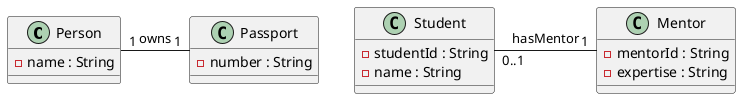
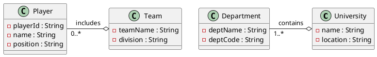
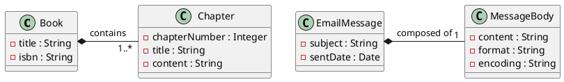

# Home Study #1 ― OOP Software Design (OOD)

<note>
<i>The present file will contain most information about OOP Software Design in depth. For this 
reason, we will be reviewing most content related to OOP design, from decisions that 
have to be made before, to development frameworks, as well as principles related to 
<code>OOP Software Design</code></i>
</note>

## Object-Oriented Design ― Fundamentals of OOP Recap

### Fundamentals of OOP Recap ― Core Concepts
<tldr>
<i>Object Oriented Programming is a programming paradigm where a system is modeled through individual 
components called classes. Each of these components abstracs away and implements a certain aspect of a real world 
part of a problem. 
</i>
</tldr>

In most programming languages (expect those that are purely functional), problems can be solved through various 
programming paradigms, systems can be modeled through these too, and most importantly, analysis and design for 
software projects can be though as a collective application of some paradigms, extracted from their programming 
world to be effective on a larger, much more abstract plane.
  
One of these paradigms has become instrumental in the world of software development as a whole, 
<code>object-oriented design and analysis</code>. A design paradigm that extends from the basics of object-oriented 
programming (OOP) and applies 
them into the creation of new software.
  
he creation of object-oriented design can be traced back to the 1960s, with the creation of Simula (a language that 
inspired C++ as it was, at the time, the first object oriented programming language). This then was followed by a 
standarization period <code>(1980s through early 1990s)</code>, capping at the creation of UML (Unified Modeling 
Language), which is the core program used to model OOD.
  
The idea behind this standardization is to <code>change the way people created software, from functions and their 
relationships, to objects and their relationships
</code>, where objects abstracted away real world entities and modeled their relationships through inheritance, 
aggregation, or composition.

### Core Concepts ― Four Pillars of OOP
<tldr><i>The four guiding principles of OOP, <code> encapsulation, abstraction, inheritance and 
polymorphism</code>, are fundamental knowledge blocks for any kind of concrete study about Object Oriented 
Design.</i></tldr>

Often when working with OOP, we came across four pillars, always repeated, always remembered, but some times 
misunderstood and relegated to theory that is not applied. Due to this, OOP does not have the same impact as it had 
in design and software creation as before, and more and more programmers stay away or adopt approaches which are 
less strict.  
Although a less restrictive approach, can be in theory, helpful when working with a codebase as a student or when 
trying to learn a language by writing a program, a concrete design system is often just as important as having 
flexbility, as this can guide our projects and help us write better and cleaner code.
  
For this reason, this section will talk about each of the core pillars to an extent, adding an example of its 
application in a straightforward warehouse management software application.

#### Four Pillars of OOP ― Encapsulation

The first pillar that we are going to discuss is one critical aspects of our implementation of OOP that is often 
discussed simply as rules set on stone. Encapsulation is the process of protecting the implementation code, the 
business logic of our classes into a class object, interface or abstract class where we define what we want to do 
internally, and allow the user only an interface (not to be confused with interfaces in Java), from which the user 
can access these methods without disturbing the inner working of our class.
  
Think about it as <code>hiding away logic that the user does not require knowing</code>, in order to make the code 
functional. Like a bank hiding its vault an offering you the ability to withdraw or deposit money. You do not know 
the process your money goes through (e.g., note checking to see if they are false, balance reviews, storage norms, 
etc.).
  
Then, the idea of this method becomes simple, it is to hide, whatever the user does not need to see, and allowing 
them to use, only the most basic set of tools for them to work effectively.

<warning><i>Although encapsulation can be though of as a part of the process of abstraction, and these two words can 
be confusing. Abstraction is not the same as encapsulation (check of this <tooltip term="Encapsulation"> 
definition</tooltip>)
</i></warning>

From this explanation, then, let us take a look at some of its pros, cons and keynotes to keep in mind

<procedure title="Four Pillars of OOP ― Encapsulation | Keys, Pros and Cons" collapsible="true">
<tabs>
<tab title="Encapsulation | Key Points">
<list>
<li><b><format color="CornFlowerBlue">Definition and Purpose</format></b>: Encapsulation refers to the 
<code>bundling of data and methods, that manipulate data within a single unit, offering only an API for interaction 
with the user.</code> This then creates a protective barrier around information, controlling its access and 
modification.</li>
<li><b><format color="CornFlowerBlue">Information Hiding</format></b>: Provides a framework of implementation that hides away information from the internal state of an object, blocking from its direct modification, allowing only getter and setters</li> 
<li><b><format color="CornFlowerBlue">Access Control</format></b>: Provides mechanisms to restrict direct access to object components, using only public methods like getters or setters.</li> 
<li><b><format color="CornFlowerBlue">Data Protection</format></b>: relies on access modifiers, and clear opened and 
closed interfaces to handle modification and access, preventing data from being modified <code>without proper 
validation</code> improving code maintainability.</li> 
</list>
</tab>
<tab title="Encapsulation | Pros">
<list>
<li><b><format color="CornFlowerBlue">Enhanced Data Security</format></b>: Protects the internal state of objects by 
<code>controlling access through well-defined interfaces</code>. This prevents unauthorized modifications and ensures data 
integrity through proper validation mechanisms.</li>
<li><b><format color="CornFlowerBlue">Improved Maintainability</format></b>: Changes to internal implementations can be made 
without affecting external code that uses the class, reducing the impact of modifications and simplifying debugging by 
containing potential issues within encapsulated units.</li>
<li><b><format color="CornFlowerBlue">Better Code Organization</format></b>: Groups related data and behaviors together in 
meaningful ways, creating <code>clear boundaries between components</code> while promoting modular design and clean 
architectural practices.</li>
<li><b><format color="CornFlowerBlue">Flexibility in Implementation</format></b>: Enables internal updates without breaking 
external code dependencies, supporting evolution of implementation while maintaining backward compatibility through stable 
public interfaces.</li>
</list>
</tab>

<tab title="Encapsulation | Cons">
<list>
<li><b><format color="CornFlowerBlue">Increased Complexity</format></b>: Requires additional code infrastructure through 
<code>getters, setters, and access control mechanisms</code>. This leads to more complex class structures and overhead in 
managing proper access permissions.</li>
<li><b><format color="CornFlowerBlue">Performance Overhead</format></b>: Introduces extra method calls for data access and 
additional memory usage for wrapper methods, which can impact performance in <code>resource-critical applications</code> where 
direct access would be more efficient.</li>
<li><b><format color="CornFlowerBlue">Development Time</format></b>: Demands more initial development effort to properly 
implement encapsulation patterns, requiring careful planning of interface design and increased time defining appropriate 
access patterns.</li>
<li><b><format color="CornFlowerBlue">Potential Overuse</format></b>: Can lead to unnecessary abstraction layers when 
applied too rigidly, potentially <code>over-complicating simple data structures</code> and generating excessive boilerplate 
code in scenarios where simpler approaches would suffice.</li>
</list>
</tab>
</tabs>
</procedure>

Let us now take a look at a simple problem (one that will be used over again in all sections). A small company 
that offers intercontinental shipping rates requires a software to manage their shipping and storage conditions. 
They have identified some objects that are required in their system, like warehouse, package, rack, etc. These 
objects will be implemented as part of the base hierarchy of classes in their OOD design.
  
Our task is to see how we can apply encapsulation to each of these objects (my task at least), simply and with clear 
attention to detail 

<procedure>
<tabs>
<tab title="Warehouse Class">

The warehouse class encapsulates most of the behavior required within the warehouse itself. It might manage 
conections to databases, or to long-term employee storage databases where it might request information about 
credentials or other identification methods for access restriction/granting.

<list type="alpha-lower"> 
<li>Inner methods like database access queries, information queries, retrieval of storage information for a 
database, as well as inputting data should be hidden underneath a <code>interface</code>, that only allows 
operators to input data and send queries, without modifying anyother aspect of the class</li>
</list>
</tab>
<tab title="Rack Class">

This rack class represents a whole storage rack in our warehouse, in this sense

<list type="alpha-lower">
<li>Its main internal state (the 
one that should be hidden from the user) has to hold a listing or a database connection to a hardware 
storage system in which we have a listing of packages stored. In the same state, we would also have some 
methods that internally check the state of a rack, and check the capacity vs usage. These can be hidden as 
they are business logic, <code>and only be out to the user through getters and state checker is 
methods</code></li></list>
</tab>
<tab title="Package Class">

The last level of this encapsulation process is to take a look at is the package class, where we would have

<list><li>
Perhaps in their state they require storing information about their handler, destination, source, etc.</li></list>
</tab>
</tabs>
</procedure>

#### Four Pillars of OOP ― Abstraction

Abstraction is a concept often overlooked when we are working in OOP. As students, our job is almost 
always cut out for us, professor tells us the classes needed to implement, and sometimes even the way to do so. This 
makes for abstraction to become almost second to the entirety of the design process.
  
However, abstraction is almost always the first step both to design and analyze an object-oriented design. Think 
about the <code>domain space of an object-oriented design problem</code>, abstraction is the main process through 
which we are going to extract the core concepts that must be represented in our application, and how these should be 
represented too.

<tldr>

<i> <tooltip term="Abstraction">Abstraction</tooltip> is the process through which developers extract information 
from a domain space, 
gathering objects, 
their characteristics (most relevant), and some state that they should hold such that their implementation is as 
close as possible to reality.</i>

</tldr>

Below, we show certain implementation details that are useful to know about abstraction. As before we define 
Keynotes, pros, and cons for this topic

<procedure title="Four Pillars of OOP ― Abstraction | Keys, Pros, and Cons" collapsible="true">
<tabs>
<tab title="Abstraction | Key Points">
<list>
<li><b><format color="CornFlowerBlue">Definition and Purpose</format></b>: Abstraction is the process of
<code>hiding complex implementation details and showing only the necessary features of an object</code>. It focuses on what an object does rather than how it does it.</li>
<li><b><format color="CornFlowerBlue">Interface Definition</format></b>: Creates a simplified view of an object through well-defined interfaces, allowing interaction without knowledge of internal complexities</li>
<li><b><format color="CornFlowerBlue">Implementation Hiding</format></b>: Separates the internal workings from the external interface, allowing changes to implementation without affecting code that uses the abstraction</li>
<li><b><format color="CornFlowerBlue">Complexity Management</format></b>: Manages system complexity by breaking down complex systems into simpler, more manageable components through <code>logical separation of concerns</code></li>
</list>
</tab>

<tab title="Abstraction | Pros">
<list>
<li><b><format color="CornFlowerBlue">Reduced Complexity</format></b>: Makes complex systems more manageable by
<code>hiding implementation details</code> behind simple interfaces, allowing developers to focus on high-level functionality</li>
<li><b><format color="CornFlowerBlue">Enhanced Maintainability</format></b>: Simplifies maintenance and updates by isolating changes to specific components without affecting the entire system</li>
<li><b><format color="CornFlowerBlue">Improved Reusability</format></b>: Promotes code reuse through well-defined interfaces that can be implemented in multiple ways, creating <code>flexible and adaptable components</code></li>
<li><b><format color="CornFlowerBlue">Better Security</format></b>: Protects internal implementations from external access, reducing the risk of unauthorized modifications and improving system security</li>
</list>
</tab>

<tab title="Abstraction | Cons">
<list>
<li><b><format color="CornFlowerBlue">Learning Curve</format></b>: Requires developers to understand and work with
<code>abstract concepts and interfaces</code>, which can be challenging for newcomers</li>
<li><b><format color="CornFlowerBlue">Design Complexity</format></b>: Creating effective abstractions requires careful planning and design experience, as poor abstractions can lead to system-wide issues</li>
<li><b><format color="CornFlowerBlue">Performance Impact</format></b>: May introduce additional layers of indirection, potentially impacting performance in <code>performance-critical applications</code></li>
<li><b><format color="CornFlowerBlue">Over-abstraction Risk</format></b>: Can lead to unnecessary complexity when applied excessively, creating <code>too many layers of abstraction</code> that make the system harder to understand and maintain</li>
</list>
</tab>
</tabs>
</procedure>

Something interesting to note here is the way in which we implement abstraction in our software design. On the one 
hand, we can implement abstraction based on abstract classes (which in turn come with their own difficulties). On 
the other hand, you can effectively implement abstraction through interfaces. There are some use cases where these 
are good, and some pros and cons for each. We shall take a look at this now (instead of the Warehouse example for 
this section)

<procedure title="Abstraction Methods | Interfaces and Abstract Classes" collapsible="true">
<tabs>
<tab title="Interfaces For Abstraction">
<tabs>
<tab title="Key Points to take home">
<list>
<li><b><format color="CornFlowerBlue">Definition</format></b>: Interfaces are structures that
define the methodology
through which an implementation will work. These often define <code>functionality or
behavior</code>, rather than methodology. And while these can be used to specify a blueprint
for any function (including setters and getters), the idea of using these structures is to
<code>specify a contract for classes whose internal state or context might not be fully related,
rather they need these abstract methods in different ways but nevertheless need them.
</code>
</li>
<li><b><format color="CornFlowerBlue">When to use Them?</format></b>: The idea of their use
stems from shared behavior but not shared state. <code>Interfaces are most commonly 
used in hierarchies where direct inheritance of implementation or state is not required</code>,
rather they are used to define additional lines of method inheritance that can be implemented by
other classes.
</li>
<li><b><format color="CornFlowerBlue">Contract Nature</format></b>: Interfaces serve as pure
contracts that define what methods a class must implement, without specifying how. They represent
a <code>can-do</code> relationship rather than an <code>is-a</code> relationship.
</li>
<li><b><format color="CornFlowerBlue">Multiple Implementation</format></b>: Unlike class inheritance,
a single class can implement multiple interfaces, allowing for more flexible design patterns and 
behavior sharing across different class hierarchies.
</li>
<li><b><format color="CornFlowerBlue">Decoupling</format></b>: Interfaces promote loose coupling
between components by allowing classes to communicate through contract definitions rather than
concrete implementations.
</li>
<li><b><format color="CornFlowerBlue">Polymorphic Behavior</format></b>: They enable polymorphism
across unrelated classes that share common behavior patterns but may have completely different
implementations.
</li>
</list>
</tab>
<tab title="Pros">
<list>
<li>Enables multiple inheritance of behavior</li>
<li>Promotes loose coupling between components</li>
<li>Facilitates unit testing through mock implementations</li>
<li>Allows for flexible system design</li>
<li>Supports polymorphic behavior across unrelated classes</li>
<li>Easier to modify without breaking implementing classes</li>
</list>
</tab>
<tab title="Cons">
<list>
<li>No implementation code can be shared</li>
<li>All methods must be implemented by classes</li>
<li>Cannot contain state (fields)</li>
<li>May lead to interface pollution if overused</li>
<li>Can result in duplicate method declarations across multiple interfaces</li>
</list>
</tab>
</tabs>
</tab>
<tab title="Abstract Classes For Abstraction">
<tabs>
<tab title="Key Points to take home">
<list>
<li><b><format color="CornFlowerBlue">Getters and Setters</format></b>: In many languages, and
specially in environments that are related to object oriented design, it is important to
consider effective and secure data <code>retrieval and modification</code> based on what are
known as <code>getter and setter method</code>. These are clear parts of the encapsulation
and specially about classes and abstract classes in general, as their methodology and 
inheritance determines how these are handled in production code.
</li>
<li><b><format color="CornFlowerBlue">When to use them?</format></b>: Abstract classes are useful when
working in OOP environments where sharing state or behavior between related classes is required.
This means that we will use abstract classes when <code>there is code that is shared, or state
shared between interrelated classes (classes that have a similar relationship)</code>, and
therefore should be grouped through a single abstract class that shares their state. 
</li>
<li><b><format color="CornFlowerBlue">What don't they have?</format></b>: These types of
structures abstract away behavior to a certain level, allowing both for implementations to be
shared, while also allowing the implementor to have some backup behavior that can be used.
</li>
<li><b><format color="CornFlowerBlue">Template Design</format></b>: Abstract classes serve as templates
for other classes, defining a common interface while allowing specific implementations in child classes.
</li>
<li><b><format color="CornFlowerBlue">Partial Implementation</format></b>: They can contain both fully
implemented methods and abstract methods that must be implemented by child classes.
</li>
<li><b><format color="CornFlowerBlue">Hierarchical Structure</format></b>: Abstract classes are ideal for
establishing class hierarchies where related classes share common functionality but require specific variations.
</li>
<li><b><format color="CornFlowerBlue">State Management</format></b>: They can maintain state through
instance variables that are shared across all implementing classes.
</li>
<li><b><format color="CornFlowerBlue">Contract Enforcement</format></b>: Abstract classes enforce a
contract through abstract methods, ensuring that derived classes implement required functionality.
</li>
</list>
</tab>
<tab title="Pros">
<list>
<li>Provides a way to share code between related classes</li>
<li>Allows partial implementation of functionality</li>
<li>Supports both state and behavior inheritance</li>
<li>Enables a consistent interface across related classes</li>
<li>Reduces code duplication</li>
</list>
</tab>
<tab title="Cons">
<list>
<li>Cannot be instantiated directly</li>
<li>Limited to single inheritance in most languages</li>
<li>May lead to tight coupling between classes</li>
<li>Can be less flexible than interfaces</li>
<li>Changes to abstract class affect all derived classes</li>
</list>
</tab>
</tabs>
</tab>
</tabs>
</procedure>

#### Four Pillars of OOP ― Inheritance
<tldr><i> Inheritance refers to the ability of an OOP 
oriented design or language to enforce patterns in the form of is-a between classes.
Effectively, inheritance is about sharing state (methods, parameters, etc) between hierarchies of 
classes through extension of classes.
</i></tldr>

Inheritance, now only second to polymorphism are one of the two most talked about components 
of OOP. Inheritance is all about sharing and caring, the idea that we all love to hear but often 
don't practice. However, in an OOP environment the idea of sharing is hugely important, it can 
<code>reduce the amount of boilerplate code (i.e., promote code reusability),</code>, and if 
used properly <code>it can create correct structures where behavior is inherited from base 
class to derived class</code>, allowing for method overriding, and through polymorphism 
non-implementing class references.
  
However promising this all might sound, we have not even attempted to talk about the topic at 
hand, we merely listed its benefits. Inheritance, then, is a process through which classes 
extend each other, some inherit a lot of methods and others do not; some share methods and 
rewrite them in their own way, others simply reuse code that has already been written. Therefore,
the correct idea about inheritance is <code>code sharing, structuration, and extension</code>. 
  
While interfaces were used directly through encapsulation to wrap behavior and share it across 
unrelated objects (to a certain extent), inheritance is a way to create links between classes 
through them effectively extending each other, taking the stuff already implemented and either 
rewriting it or expanding upon it.
  
This relationship forms what is known as a <code>base class &lt; - &gt; derived class 
relationship</code>.
In general, this relationship is often better seen through the way the methods are passing down 
through the classes. For example, we might have a base class known as <code>vehicle</code>, if 
this vehicle class then needs to be specialized, we might go ahead and implement it as a 
<code>car</code> class. In this sense, we know that <code>a car is a vehicle</code>, and 
therefore the parent class is vehicle, and the child class is car.
  
While the concept of inheritance is relatively simple, we should also take a look at a tiny 
listing which discusses the types of inheritance that we can see in an OOD environment

<procedure title="Four Pillars of OOP ― Inheritance | Types of Inheritance" collapsible="true">
<list>
<li><b><format color="CornFlowerBlue">Single Inheritance</format></b>: Defined as the type of 
inheritance where a single class extends from (or inherits) only one parent class. This 
relationship establishes a simple <b>hierarchy</b> between the child and parent classes. As a 
result, the child class inherits all the accessible methods and attributes of the parent class, 
which helps in achieving <b>code reusability</b> and <b>modularity</b>. For example, in a 
<code>Vehicle</code> 
base class, a <code>Car</code> class might inherit properties like speed or fuel type while 
defining its own 
specific attributes like number of doors or car type.</li>
<li><b><format color="CornFlowerBlue">Multiple Inheritance</format></b>: Defined as the type of 
inheritance where a class inherits state and behavior from two or more parent classes. This type 
of inheritance allows the child class to <b>combine functionalities</b> from multiple parent 
classes, making it a powerful tool for code reuse and functionality merging. For instance, a 
<code>FlyingCar</code> class could inherit from two parent classes: `Car` (for driving-related behaviors) and 
<code>Airplane</code> (for flying-related behaviors). However, multiple inheritance can lead to complications such 
as <b>ambiguities</b> (e.g., when two parent classes have methods with the same name), making it 
harder to 
maintain and debug in certain scenarios.</li>
<li><b><format color="CornFlowerBlue">Multilevel Inheritance</format></b>: Defined as the type 
of inheritance where a class derives from another class, which itself is inherited from a third 
class. In other words, this creates a <b>chain of inheritance</b> where properties and methods are 
passed down through multiple levels of ancestors. For example, consider a <code>LivingThing</code> base 
class inherited by an <code>Animal</code> class, which in turn is inherited by a 
<code>Dog</code> class. Here, <code>Dog</code> could have access to the attributes or methods 
defined in both the <code>Animal</code> and <code>LivingThing</code> classes. This type of inheritance is useful for 
creating <b>hierarchical structures</b>, but may make the inheritance chain overly complex if not 
carefully implemented.</li>
<li><b><format color="CornFlowerBlue">Hierarchical Inheritance</format></b>: Defined as the type 
of inheritance where multiple child classes inherit from a single parent class. This is akin to 
a tree-like structure, where the parent class acts as the root, and the child classes implement 
specialized versions of the parent's functionality. For example, a <code>Shape</code> parent class could have 
children such as <code>Circle</code>, <code>Rectangle</code>, and <code>Triangle</code>, where each child class 
implements its own specific methods (e.g., area or perimeter calculation). Hierarchical 
inheritance supports <b>code reusability</b>, and it is particularly useful when multiple classes share common 
base functionality while diverging in specific implementations.</li>
<li><b><format color="CornFlowerBlue">Hybrid Inheritance</format></b>: Defined as the type of 
inheritance that combines two or more forms of inheritance—such as single, multiple, 
hierarchical, or multilevel—to form a refined class structure. For example, a <code>Vehicle</code> parent class 
might have two child classes (<code>Car</code> and <code>Ship</code>), while another class, say 
<code>AmphibiousVehicle</code>, could inherit from both <code>Car</code> and <code>Ship</code> (applying 
multiple inheritance). This hybrid structure can be quite <b>flexible</b> but carries the risk of 
<b>inheritance ambiguity</b> in certain scenarios, typically resolved by mechanisms like the Method Resolution Order (MRO) 
in languages like Python.</li>
</list>
</procedure>

Now one of the most important aspects that all inheritance types rely upon is the 
ability of methods to be overridden in a base class rather than these keeping the parent class's 
implementations. The idea of method overloading is not new, we generally use it within our own 
files and classes to have name-equal methods with different parameter lists, but the idea of 
overriding a method in another derived class is something that while used excessively in our code,
is not discussed as deeply as it should be. In this next section we will dedicate a blockquote 
to discussing the intricacies of overriding methods when it comes to inheritance.

<procedure title="Four Pillars of OOP ― Inheritance | Method Overriding Fundamentals" 
collapsible="true">
<note>Method overriding is a mechanism in OOP, that allows a subclass to provide a specific 
implementation for a method that is already defined in its superclass.</note>

The idea behind overloading is basic <code>take some already implemented method (i.e., 
inherit it)
</code>, and if you don't like or need the current implementation, or it is too general then 
<code>override the method to suit the implementation class's needs</code>. By this line of 
thought then, method overriding keeps the original prototype of the method and effectively only 
changes the implementation (parameters, name, access modifiers, or other parameters cannot be 
changed).
  
Internally then, there will be at least two things that can happen, <code>a) we will create an 
environment suitable for polymorphism </code>, and <code>b) we will create an environment 
suitable for extensibility in object-oriented systems</code>. However, this does not come with 
no tradeoffs, potential pitfalls, and guidelines to be followed

<code>Rules for Method Overriding in OOP</code>
<list type="bullet" sorted="asc">
<li><b><format color="CornFlowerBlue">Method Signature</format></b>: everything in the 
original method signature (inherited method) should remain the same in the overridden 
version of said method</li>
<li><b><format color="CornFlowerBlue">Access Level</format></b>: in general <code>the 
visibility (access level)</code> of an overridden method should be <code>more 
accessible or equal to the original method</code></li>
<li><b><format color="CornFlowerBlue">Exception Handling</format></b>: an overridden method 
should throw either <code> more centered exceptions or the same, no broader ones</code> </li>
<li><b><format color="CornFlowerBlue">Return Type</format></b>: should be the same type of the 
overridden method or a subtype of said type
</li> 
</list>

Additionaly, one should consider the pros and cons for this type of structure carefully. 
There are certain benefits, of course, to using this level of variation in our OOD designs. 
<code>As we have discussed, polymorphic code is based on overriding methods</code>. Additionally,
it allows for reusability. 
  
Despite it souding a bit weird, given that we are effectively replacing and creating more code, 
it makes sense when you consider that if we were not to use this methodology, specialized 
classes would require to effectively rewrite a method exactly like the other with a different 
implementation, duplicating code, and <code>causing rigidity (which is alleviated by the use 
of method overriding)</code>, allowing for classes to extend and add onto the behavior of a 
parent class without removing the previous code.
  
Lastly, it is important to note that both abstract classes and interfaces use this to make sure 
that we are enforced to fulfill contracts during implementation phases.

</procedure>

So far we have discussed inheritance as a tool that in general could be thought of as the 
solution to all of our problems in an OOD environment. If we need to share some behavior well, 
use an abstract class and inherit it down. If we want to specialize an already somewhat 
specialized class then inherit down and override its methods, but, is this really goood?
  
So far we have seen all the positives, and for this reason, our view might attempt to force us 
down a path of multiple inheritance layers, complex structures, and we would often do this, were 
we not to know about the pitfalls of this potential design. These will be covered in a tiny 
listing in another blockquote as the purpose of this page is not to go too deep into OOP.

<procedure title="Four Pillars of OOP ― Inheritance | Common Problems, Challenges, and a 
proposed solution" 
collapsible="true">
<list>
<li><b><format color="CornFlowerBlue">Diamong Problem in Multiple Inheritance</format></b>: This 
can happen when a class <code>inherits from two distinct classes (call them B, and C), 
but these two inherit from the same parent class (A)</code>, these two classes then create a 
complex triangulation between parent classes, in which if a method coming from A is overridden 
in both B and C and the last derived class <code>does not override it</code>, it can then lead 
to complex issues to determine which class's method to call (this is why Java does not support 
multiple inheritance at the class level.
 
The way to solve this depends on the language we are using, but it is generally advisable to 
think about reducing the relationships between each class, switching the type of inheritance or 
reviewing the real need to have such a nested inheritance structure. In Java, for example, this 
is solved through interface inheritance (even if they have the same method, the implementation 
is supplied to both).
</li>
<li><b><format color="CornFlowerBlue">Tight Coupling Issues</format></b>: 
Inheritance can lead to tight coupling because the derived class is directly dependent on the 
base class. When a class inherits from another, it tightly binds itself to the base class's 
implementation and structure. This means you cannot easily swap out or modify the base class 
without impacting all derived classes. If the base class changes, it could potentially break the 
functionality of the derived class, creating a rigid dependency that is hard to maintain or 
refactor.

In contrast, using composition alongside interfaces or abstract classes can reduce coupling. 
With composition, a class depends on abstractions rather than concrete implementations, allowing 
for greater flexibility. By passing interfaces as dependencies, you can easily swap out 
implementations without altering the class that uses them. This makes composition an effective 
alternative for building extensible and maintainable systems compared to the rigidity of 
inheritance-based designs.
</li> 
<li><b><format color="CornFlowerBlue">Deep Inheritance Hierarchies</format></b>: In general, 
using multiple hierachies and inheritance patterns can lead to overly nested inehritance trees, 
some cases of this can be seen even in Java's libraries with inheritance trees from object all 
the way down to data structure implementations.

The solution to this issue is to re-architect our applications and reduce the level of 
complexity. In some cases using composition can be a better way to achieve the same results. 
</li> 
<li><b><format color="CornFlowerBlue">Code Duplication in Inheritance</format></b>: Code 
duplication in inheritance can be problematic because it often forces derived classes to either 
reuse irrelevant functionality from the base class or rewrite methods to suit their specific 
needs, leading to unnecessary duplication. This occurs especially when the base class contains 
logic that doesn't fully align with the responsibilities of all its derived classes. Over time, 
this duplication grows as more subclasses are added, increasing code complexity and reducing 
maintainability. Additionally, changes to shared functionality in the base class can 
inadvertently cause issues across all inherited classes, making modifications risky and error-prone.

Using composition instead of inheritance helps address code duplication by encouraging 
developers to create modular, reusable components that can be combined in different ways. By 
relying on interfaces or abstract classes, shared behaviors can be implemented independently and 
injected into the required classes, reducing duplication while improving flexibility and 
scalability. This approach aligns with the "composition over inheritance" principle, which 
emphasizes the importance of favoring composition to avoid the common pitfalls of inheritance
</li> 
</list></procedure>

#### Four Pillars of OOP ― Polymorphism
<tldr><i><tooltip term="Polymorphism"> Polymorphism</tooltip> is the fourth and most important 
pillar of OOP, it is based on the concept of allowing <code>a child object to be 
accessed and reference through a reference of the base case class</code>, allowing for quick 
and simple method overriding to decide during runtime the method to use through the object's 
real type.</i></tldr>

Polymorphim will be the last topic we touch on this review of OOP concepts. This section however,
will not go as in depth as we would otherwise go as we require time for other topics that must 
be covered in a somewhat rigorous OOD course.
  
Polymorphism is defined somewhat loosely as the ability of of a derived object to be treated 
through a reference of the parent class, or super clas. In essence this is true, however we must 
notice that this is not the only purpose that this allows, as it also <code>facilitates the 
use of compile time type identification and provides a framework for languages to implement 
method overriding</code>. These two innate abilities of the concept are what make it, along with 
inheritance, to be the base of most OOP principle lists, and the basis of systems designed using 
OOD.
  
It is important then to take a look at some of the pros, cons and key notes of the concept 
before moving on.

<procedure title="Four Pillars of OOP ― Polymorphism | Keys, Pros, and Cons" collapsible="true">
<tabs>
<tab title="Polymorphism | Key Points">
<list>
<li><b><format color="CornFlowerBlue">Definition and Purpose</format></b>: Polymorphism enables
<code>objects of different types to be treated as objects of a common base type</code>, allowing methods to process
data differently based on the object's actual type while maintaining a common interface.</li>

<li><b><format color="CornFlowerBlue">Runtime Behavior</format></b>: Allows the selection of appropriate method
implementations at runtime, enabling dynamic method dispatch based on the actual object type rather than the
reference type.</li>

<li><b><format color="CornFlowerBlue">Type Flexibility</format></b>: Provides the ability to write code that can
work with objects of multiple types through <code>base class references or interface implementations</code>,
promoting code reusability and flexibility.</li>

<li><b><format color="CornFlowerBlue">Implementation Forms</format></b>: Manifests in two primary forms:
<code>compile-time (method overloading) and runtime (method overriding)</code>, each serving different purposes in
object-oriented design.</li>
</list>
</tab>

<tab title="Polymorphism | Pros">
<list>
<li><b><format color="CornFlowerBlue">Enhanced Flexibility</format></b>: Enables <code>writing code that can work
with current and future types</code>, making systems more extensible and adaptable to change without modifying
existing code.</li>

<li><b><format color="CornFlowerBlue">Code Reusability</format></b>: Promotes the creation of generic algorithms
that can operate on objects of different types, reducing code duplication and improving maintainability.</li>

<li><b><format color="CornFlowerBlue">Clean Architecture</format></b>: Facilitates the implementation of clean and
modular designs by <code>allowing different objects to respond uniquely to the same method calls</code>, supporting
the Open-Closed Principle.</li>

<li><b><format color="CornFlowerBlue">Runtime Adaptability</format></b>: Enables systems to dynamically choose
appropriate behaviors based on object types, making applications more flexible and responsive to different
scenarios.</li>
</list>
</tab>

<tab title="Polymorphism | Cons">
<list>
<li><b><format color="CornFlowerBlue">Performance Impact</format></b>: Dynamic method dispatch can introduce
<code>runtime overhead due to virtual table lookups</code> and additional memory requirements for virtual method
tables.</li>

<li><b><format color="CornFlowerBlue">Complexity</format></b>: Can make code harder to follow and debug due to
the indirect nature of method calls and the need to understand the complete type hierarchy to predict behavior.</li>

<li><b><format color="CornFlowerBlue">Potential Misuse</format></b>: Overuse of polymorphism can lead to
<code>overly complex hierarchies and unnecessary abstractions</code>, making the system harder to understand and
maintain.</li>

<li><b><format color="CornFlowerBlue">Testing Challenges</format></b>: Requires comprehensive testing across all
implementing classes to ensure correct behavior, increasing the testing effort and complexity.</li>
</list>
</tab>
</tabs>
</procedure>

As can be noted through the previous definitions, there are two exact distinctions in terms 
of the fields where it works. Generally these two are divided into compile-time and runtime 
polymorphism, and both come with their own pros and cons respectively.

<procedure title="Four Pillars of OOP ― Polymorphism | Compile-time Polymorphism" collapsible="false">

Compile-time polymorphism is defined as a feature in object-oriented programming that allows 
a function or method to <code>behave differently, based on the amount, type or sequence 
of parameters.</code> This then determines that for a single class or various classes their 
methods can have multiple versions of themselves, adapted to a number of parameters.
  
This is often achieved through <code>method overloading</code>, that, as we have explained 
earlier in this file, consists of changing the order, number of, or type of, a parameter's method, 
but at the same time keeping the name, visibility*, and return type*, the same. This then  
differs from what we have seen as method overriding since it does not replace the original 
version of a method, rather it basically introduces its own new version.
  
Compile-time polymorphism is often resolved faster than runtime polymorphism, due to it being 
addressed, and its methods resolved,before execution, in a part of execution that is often 
faster. This then allows for quick method determination in applications where this concept is 
used.
  
The following are some key points, pros, and cons about compile-time polymorphism

<procedure title="Four Pillars of OOP ― Compile-Time Polymorphism | Keys, Pros, and Cons" 
collapsible="true">
<tabs>
<tab title="Compile-Time Polymorphism | Key Points">
<list>
<li><b><format color="CornFlowerBlue">Definition and Purpose</format></b>: Compile-time 
polymorphism, also known as static polymorphism, enables <code>methods to exhibit different 
behaviors based on parameter types, count, or sequence</code>, resolved during compilation 
rather than runtime.</li>
<li><b><format color="CornFlowerBlue">Method Overloading</format></b>: Primary mechanism that allows
<code>multiple methods with the same name but different parameter lists</code> to coexist within 
the same class, providing different implementations based on input types.</li>

<li><b><format color="CornFlowerBlue">Early Binding</format></b>: Method resolution occurs at 
compile time, where the compiler <code>determines which method version to call based on the 
method signature</code>, resulting in faster execution compared to runtime polymorphism.</li>

<li><b><format color="CornFlowerBlue">Type Safety</format></b>: Provides strong type checking at 
compile time, helping to <code>catch type-related errors before program execution</code> and 
ensuring type-safe method invocations.</li>
</list>
</tab>
<tab title="Compile-Time Polymorphism | Pros">
<list>
<li><b><format color="CornFlowerBlue">Better Performance</format></b>: Offers <code>faster 
execution compared to runtime polymorphism</code> as method binding is resolved during 
compilation, eliminating runtime method lookup overhead.</li>
<li><b><format color="CornFlowerBlue">Type Safety</format></b>: Ensures stronger type checking 
at compile time, reducing runtime errors and improving program reliability through early error 
detection.</li>

<li><b><format color="CornFlowerBlue">Method Flexibility</format></b>: Allows creation of 
multiple method versions to handle different parameter types and combinations, improving API 
usability and code readability.</li>

<li><b><format color="CornFlowerBlue">Clear Intent</format></b>: Makes code more intuitive by 
allowing <code>methods with the same name to handle different parameter scenarios</code>, 
improving code organization and maintainability.</li>
</list>
</tab>

<tab title="Compile-Time Polymorphism | Cons">
<list>
<li><b><format color="CornFlowerBlue">Limited Flexibility</format></b>: Cannot handle 
<code>scenarios where the type of object is determined at runtime</code>, limiting its use in 
dynamic type situations.</li>
<li><b><format color="CornFlowerBlue">Code Duplication</format></b>: May lead to similar code 
being repeated across overloaded methods when the logic is similar but not identical, 
potentially increasing maintenance burden.</li>
<li><b><format color="CornFlowerBlue">Complexity in Method Selection</format></b>: Can lead to
<code>ambiguous method calls when dealing with complex parameter type hierarchies</code> or 
automatic type conversions.</li>
<li><b><format color="CornFlowerBlue">Design Limitations</format></b>: Restricted to varying 
method signatures only, cannot achieve true dynamic behavior that runtime polymorphism offers 
through inheritance and interfaces.</li>
</list>
</tab>
</tabs>
</procedure>

Therefore, this method is best used in special cases were having overloaded methods is 
important, for example, in constructors, getters o setter. However, we should always assess the 
requirements of any class before implementing one or more overloaded methods. The next 
blockquote will provide information about runtime polymorphism

</procedure>
<procedure title="Four Pillars of OOP ― Polymorphism | Runtime Polymorphism" collapsible="false">

Runtime polymorphism can be defined as the process through which, after compilation and 
execution, an object oriented language is capable of detecting the type of an object and infer 
which method should be called depending on it. This means that <code>overridden methods 
are resolved during runtime (when addressed through instances of the base class)</code>.
  
This is common in languages like Java, where in complex hierarchical structures inherited 
methods can be called using the interface or abstract class that is implemented behind it (think 
about Collections helper method requiring a list rather than an ArrayList, or a Collection 
rather than a specific set.) Through this method then, our code becomes a bit slower due to the 
overhead at runtime, but it allows us to reduce the need to overload methods for all 
implementing classes, and rather separate implementors by a set of common ground abstract 
classes or interfaces to use.
  
Below we can see a simple set of key points, pros, and cons for this model too.

<procedure title="Four Pillars of OOP ― Runtime Polymorphism | Keys, Pros, and Cons" 
collapsible="true">
<tabs>
<tab title="Runtime Polymorphism | Key Points">
<list>
<li><b><format color="CornFlowerBlue">Definition and Purpose</format></b>: Runtime polymorphism, 
also known as dynamic polymorphism, enables <code>objects to determine their type and 
appropriate method implementations during program execution</code>, allowing for flexible and 
dynamic behavior.</li>
<li><b><format color="CornFlowerBlue">Method Overriding</format></b>: Core mechanism where <code>subclasses provide
specific implementations of methods defined in their parent classes</code>, allowing different objects to respond
differently to the same method call.</li>

<li><b><format color="CornFlowerBlue">Late Binding</format></b>: Method resolution occurs at runtime through
<code>virtual method tables and dynamic dispatch</code>, enabling the program to select the appropriate method
implementation based on the actual object type.</li>

<li><b><format color="CornFlowerBlue">Inheritance Requirement</format></b>: Relies on inheritance hierarchies and
interface implementations to <code>establish relationships between classes that enable polymorphic behavior</code>
through base class references.</li>
</list>
</tab>

<tab title="Runtime Polymorphism | Pros">
<list>
<li><b><format color="CornFlowerBlue">Dynamic Flexibility</format></b>: Enables <code>systems to handle different
object types through a common interface</code>, supporting extensibility and adaptable behavior without modifying
existing code.</li>

<li><b><format color="CornFlowerBlue">Code Reusability</format></b>: Promotes the creation of generic, reusable
code that can work with both existing and future class implementations through base class references.</li>

<li><b><format color="CornFlowerBlue">Loose Coupling</format></b>: Facilitates <code>loose coupling between
components by allowing interaction through abstractions</code> rather than concrete implementations.</li>

<li><b><format color="CornFlowerBlue">Design Flexibility</format></b>: Supports the implementation of flexible and
extensible architectures that can easily accommodate new types and behaviors without structural changes.</li>
</list>
</tab>

<tab title="Runtime Polymorphism | Cons">
<list>
<li><b><format color="CornFlowerBlue">Performance Overhead</format></b>: Introduces <code>runtime overhead due to
dynamic dispatch and virtual method table lookups</code>, potentially impacting performance in performance-critical
applications.</li>

<li><b><format color="CornFlowerBlue">Memory Usage</format></b>: Requires additional memory to maintain virtual
method tables and runtime type information for each polymorphic class.</li>

<li><b><format color="CornFlowerBlue">Complexity</format></b>: Can make code flow harder to follow due to
<code>indirect method calls and the need to understand the complete inheritance hierarchy</code> to predict
behavior.</li>

<li><b><format color="CornFlowerBlue">Debug Challenges</format></b>: Makes debugging more challenging as the actual
method implementation being called isn't immediately apparent from the source code and depends on runtime
conditions.</li>
</list>
</tab>
</tabs>
</procedure>

It is important to note then that these two can be used for various examples of 
implementations, be it in the same class or with a hierarchy of classes. The ideas to go from to 
chose which over the other are going to be discussed in the next section

</procedure>
<procedure title="Four Pillars of OOP ― Polymorphism | Method Overloading vs method Overriding" 
collapsible="false">
<table>
<tr>
<td><b>Comparison Point</b></td>
<td><b>Method Overloading</b></td> 
<td><b>Method Overriding</b></td>
</tr>

<tr>
<td><b>Definition</b></td>
<td>Multiple methods with the same name but different parameters in the same class</td>
<td>Redefining method of parent class in child class with the same signature</td>
</tr>

<tr>
<td><b>Binding Type</b></td>
<td>Compile-time (Static) binding</td>
<td>Runtime (Dynamic) binding</td>
</tr>

<tr>
<td><b>Method Signature</b></td>
<td>Must have different parameters (type, number, or order)</td>
<td>Must have identical parameters and return type</td>
</tr>

<tr>
<td><b>Inheritance</b></td>
<td>Not required, occurs within the same class</td>
<td>Required, occurs between parent and child classes</td>
</tr>

<tr>
<td><b>Best Use Cases</b></td>
<td>

- Constructor initialization with different parameters
- Utility methods handling different data types
- API flexibility with different parameter options
- Mathematical operations with different numeric types
</td>
<td>

- Implementing specialized behavior in child classes
- Framework customization
- Plugin architecture implementation
- Template method pattern implementation
</td>
</tr>

<tr>
<td><b>When to Avoid</b></td>
<td>

- When parameter differences are not meaningful
- When logic is identical across overloads
- When it leads to ambiguous method calls
- When optional parameters could be used instead
</td>
<td>

- When base implementation is sufficient
- When it violates LSP (Liskov Substitution Principle)
- When composition would be more appropriate
- When it creates deep inheritance hierarchies
</td>
</tr>

<tr>
<td><b>Performance Impact</b></td>
<td>Minimal, resolved at compile time</td>
<td>Small overhead due to virtual table lookup</td>
</tr>

<tr>
<td><b>Error Detection</b></td>
<td>Compile-time errors for invalid calls</td>
<td>Runtime errors for incorrect implementations</td>
</tr>

<tr>
<td><b>Flexibility</b></td>
<td>Limited to compile-time decisions</td>
<td>Supports runtime polymorphic behavior</td>
</tr>

<tr>
<td><b>Common Patterns</b></td>
<td>

- Builder pattern
- Factory method pattern
- Command pattern variations
</td>
<td>

- Strategy pattern
- Template method pattern
- Observer pattern
</td>
</tr>
</table>
</procedure>

## Object-Oriented Design ― Class Relationship

Within an OOD system design, we have to think not only about the core OOP concepts and how 
to apply these. Rather, we also have to think about the classes, interfaces, abstract classes, 
among other utilitarian objects (depends on the language) that can be created to suite the needs 
of the analysis and design phases of an OOD project.
  
Aside from creating the objects, interfaces, etc., etc.,etc., that we require to implement the 
hierarchy required by the analysis phase, we also need to think about the <code>relationships 
between these objects, their instances, and the way they communicate with each other
</code>. In this sense, we have three concepts that are clear when it comes to OOD, these are 
Association (weakest form of class interrelation), aggregation (second strongest form of class 
interrealtion), and composition (strongest form of class interrelation)
  
Each of these will be presented with a set of guidelines for their application, pros, cons, key 
points to remember, and a Java implementation for reference

### Class Relationships ― Association

Association is known as the weakest form of class aggreation as it does not indicate that an 
object depends on the existance of another for its existance, nor that it at some point will 
manage an instance of another object. This then means that it does not implement a 
<code>part-of or has-a</code> design, rather association is defined as <code>two objects 
"known" each other</code>, which effectively means that they are not specifically dependent on 
the other for existance, nor does one depend exclusively on a larger holder objct for its 
existance
  
Below is a concrete definition of association

<note>Association is a <tooltip term="Semantic">semantically</tooltip> weak relationship(a 
semantic dependency) between otherwise unrelated objects. An association is a "using" 
relationship between two or more objects in which the objects have their own lifetime and 
there is no owner.</note>

Association then, is a supertype of class interrelation in which to some extent, classes are 
not related by state or by a has-a dependency or a part-of dependecy (as in the cases of 
aggregation and composition). The idea behind this type of interrelation is that 
<code>all objects have their own life cycle and there is no "owner" or parent, meaning 
they can be created and destroyed independently.</code>
  
Additionally, association can be defined in three levels, <code>one-to-one, one-to-many, and 
manny-to-many</code>. Definitions that will be reviewed in a moment.

#### Association ― Key points, pros, and cons

One of the most important aspects to remember about association is the fact that 
<code>an association between two or more objects denote a path of communication, so that 
one object can send a message to another</code>. The second most important point to remember is 
<code>that each object is owner of themselves and can be killed independently</code>
  
Independently of this simple definition, here are some key points, pros and cons expanded upon 
by our friend Amazon Q

<procedure title="Association ― Key Notes, Pros, and Cons" collapsible="true">
<tabs>
<tab title="Association | Key Points">
<list>
<li><b><format color="CornFlowerBlue">Definition and Purpose</format></b>: Association is the relationship between two or more classes that establishes a <code>connection allowing them to interact with each other</code>. It defines how objects of different classes communicate.</li>
<li><b><format color="CornFlowerBlue">Relationship Types</format></b>: Can be unidirectional (one class knows about the other) or bidirectional (both classes are aware of each other)</li>
<li><b><format color="CornFlowerBlue">Independence</format></b>: Associated classes maintain their independent lifecycle, meaning objects can exist independently of each other</li>
<li><b><format color="CornFlowerBlue">Coupling Level</format></b>: Represents a <code>loose coupling between classes</code>, where objects interact while maintaining their separate identities</li>
</list>
</tab>

<tab title="Association | Pros">
<list>
<li><b><format color="CornFlowerBlue">Flexibility</format></b>: Allows for <code>dynamic relationships</code> between objects that can be established and broken as needed</li>
<li><b><format color="CornFlowerBlue">Clear Structure</format></b>: Provides a clear way to represent real-world relationships between different entities in code</li>
<li><b><format color="CornFlowerBlue">Modularity</format></b>: Enables creation of modular systems where objects can interact without tight dependencies</li>
<li><b><format color="CornFlowerBlue">Maintainability</format></b>: Makes it easier to modify relationships between classes without affecting their core functionality</li>
</list>
</tab>

<tab title="Association | Cons">
<list>
<li><b><format color="CornFlowerBlue">Complexity Management</format></b>: Can become difficult to manage when dealing with <code>multiple associations across many classes</code></li>
<li><b><format color="CornFlowerBlue">Performance Overhead</format></b>: Managing relationships between objects can introduce additional memory and processing overhead</li>
<li><b><format color="CornFlowerBlue">Design Challenges</format></b>: Requires careful consideration to determine the appropriate type and direction of associations</li>
<li><b><format color="CornFlowerBlue">Potential Coupling Issues</format></b>: If not designed properly, can lead to <code>unnecessary dependencies between classes</code></li>
</list>
</tab>
</tabs>
</procedure>

#### Association - Types  

Before, we defined the types of association that can exist between classes. For example we defined the case of 
bidirectional or unidirectional association. This is often realized through shared or connected references that 
allow one, or both, objects to know about the other. For example, <code>a unidirectional association</code>, can be 
modeled through <b>a Person and their hobbies</b>, a person has a series of hobbies that can be represented through 
arrays or references to multiple data structures, however no single hobby can effectively reference back to a person 
as these are not part of it, they are just friends, links between them that unite them.
  
On the other hand, if we were to model a relationship between a dog and a Person, the association between them would 
be <code>bidirectional</code> (since a dog is not an integral part of a human it is not composition, since it is not 
a strongly required component it is not aggregated, rather it is simply associated with a human class). Therefore, a 
<code>Person knows and has a dog</code>, while a <code>Dog knows and has an owner, a human</code>. Note here that 
although we use the word owns, this does not mean that when the human goes out of scope (e.g., passes away), the dog 
will too, rather they are aggregated as the dog can still go on living without the need to have knowledge of its 
owner's current state.
  
Furthermore, within <code>bidirectional (or binary) associations</code>, there are some concepts like 
<b>multiplicity we should discuss</b>.

<note>Multiplicity refers to the number of objects from one class associated to another on each end. This then means 
that <code>we could represent relationships in the type of</code>  <b>one-to-one, zero-or-more, 1-or-more, 
and multiple</b></note>

Often is it useful to think as <b>associations as the embodiment of verbs in problem statements</b>(A person has 
zero or more hobbies, A Person owns(adopts) a dog, a group contains many persons, a polygon is made up of multiple 
points ad lines)
  
Effectively then, we must see associations as weak bonds between classes, not one of the two control the other 
directly (composition) or somewhat  controls its state(aggregtion), rather they are entities on their own, 
<code>whose references must be managed separately</code>

Additionally to these, there are <code>ternary and higher order associations (often using links)</code>, which we 
can also discuss in this section.
  
Generally, ternary and higher order associations often happen in systems where the real world model depends on 
multiple interweaving associations. A common example of this is an application to design an OOD-based committee 
manager project. In here we can have the class Year to represent time, Committee to represent the actual object, and 
the Person class to represent those members of each committee.
The idea then is that <code>some classes here will not just have a binary association, or a bidirectional 
association, rather they might have a zero-to-three o zero-to-four o one-to-two, etc.</code>, association.
  
The idea then is to articulate a set of references to multiple objects within each of these classes (of course 
depending on the type of connection (bidirectional or unidirectional) we may need to create <code>candidate 
keys</code>, but the topic of these falls outside of the scope for this chapter.

<tldr>Association can be binary, ternary or n-ary. The communication between classes can be unidirectional or 
bidirectional</tldr>

Lastly, here is an example of how to visualize association

<procedure>

Here is a PlantUML example demonstrating how to represent associations in a binary one-to-one way and a unary zero-to-one way:

In the diagram above:

<list>
    <li><b><format color="CornFlowerBlue">Binary One-to-One</format></b>: 

The association between `Person` and `Passport` illustrates that each `Person` owns exactly one `Passport`, and each `Passport` is uniquely assigned to exactly one `Person`. This represents a strict one-to-one mapping.
</li>
    <li><b><format color="CornFlowerBlue">Unary Zero-to-One</format></b>: 

The relationship between `Student` and `Mentor` shows that a `Student` can optionally have a `Mentor`, but every `Mentor` must mentor exactly one `Student`. This demonstrates a zero-to-one association with optionality for the `Student` side.
</li>
</list>
</procedure>

### Class Relationships ― Aggregation

Aggregation is a somewhat stronger version of <code>association</code> in which two or more objects have their 
own life cycle but have a certain ownership relationship as well. It is typically represented as a 
<code>parent/child or whole/part relationship</code>
  
Effectively, the one condition that separates composition from aggregation is that the parent/holder/etc. can live 
without the child/part/etc. instance. In composition, a parent often cannot live without its component part. 
Furthermore, <code>the relationships between classes in aggregation is not reciprocal</code>, although an object may 
own another one, this is not true the other way around. In essence, aggregation is a subtype (one step from becoming)
composition given that it already indicates some level of ownership and composition between part and whole, however 
composition is the strongest form of part-and-whole relationships in OOD.
  We must also note that <code>multiplicity in terms of aggregation can be any integer value, meaning 
that a class's objects can be used in more than one instance of anothr parent class</code>
  
Below we discuss some of the key points, pros and cons about aggregation.

<note><i>Aggregation is a specialized form of association between two or more objects in which each object 
has its own life cycle but there exists an ownership as well (Typically modeled as a 
<code>parent/child, whole/part relationship</code></i></note>

#### Aggregation — Key points, pros, and cons

<procedure title="Aggregation ― keynotes, Pros, and Cons" collapsible="true">
<tabs>
<tab title="Aggregation | Key Points">
<list>
<li><b><format color="CornFlowerBlue">Definition and Purpose</format></b>: Aggregation represents a "whole-part" or "has-a" relationship where one class <code>contains or owns other class objects</code> but the contained objects can exist independently.</li>
<li><b><format color="CornFlowerBlue">Relationship Types</format></b>: Typically unidirectional, where the container (whole) knows about its parts, but parts don't necessarily know about the container</li>
<li><b><format color="CornFlowerBlue">Independence</format></b>: Parts can exist independently of the whole, meaning the lifecycle of contained objects is not tied to the container</li>
<li><b><format color="CornFlowerBlue">Coupling Level</format></b>: Represents a <code>medium coupling between classes</code>, stronger than association but weaker than composition</li>
</list>
</tab>
<tab title="Aggregation | Pros">
<list>
<li><b><format color="CornFlowerBlue">Reusability</format></b>: Allows <code>parts to be shared</code> among multiple wholes, increasing code reuse</li>
<li><b><format color="CornFlowerBlue">Flexibility</format></b>: Parts can be added or removed from the whole without affecting their existence</li>
<li><b><format color="CornFlowerBlue">Natural Modeling</format></b>: Effectively represents real-world relationships where components can exist independently</li>
<li><format color="CornFlowerBlue" style="bold">Loose Binding</format>: Maintains a balance between connection and independence, 
allowing for flexible system design</li>
</list>
</tab>
<tab title="Aggregation | Cons">
<list>
<li><format color="CornFlowerBlue" style="bold" >Memory Management</format>: 
Can be complex to manage when <code>parts are 
shared among multiple containers</code>
</li>
<li><format color="CornFlowerBlue" style="bold">Relationship Clarity</format>: 
Sometimes difficult to determine 
whether to use aggregation or composition
</li>
<li><b><format color="CornFlowerBlue">State Management</format></b>: 
Requires careful handling of shared objects to maintain consistency across the system
</li>
<li><b><format color="CornFlowerBlue">Implementation Complexity</format></b>: 
May need additional code to <code>track and manage relationships</code> between containers and parts
</li>
</list>
</tab>
</tabs>
</procedure>

Given that this type of class relationships does not have a set of subtypes, we will move on to a set of examples 
to showcase how this would be seen in a UML diagram

<procedure>

Here is a PlantUML example demonstrating how to represent aggregation relationships with different multiplicities:

In the diagram above:

<list>
    <li><b><format color="CornFlowerBlue">One-to-Many Aggregation</format></b>:
    
The relationship between University and Department shows that a University contains one or more Departments (1..*). The hollow diamond on the University side indicates aggregation, meaning departments can exist independently of the university. Each department is part of the university structure, but could potentially be transferred or exist separately.

    </li>
<li><b><format color="CornFlowerBlue">Optional Many Aggregation</format></b>: 

The relationship between Team and Player demonstrates that a Team can include zero or more Players (0..*). The aggregation indicates that players are part of the team but maintain their independence. Players can exist without a team and can be transferred between teams while maintaining their own identity.

</li>
</list>
</procedure>

### Class Relationships ― Composition

Composition is the strongest type of class relationship. This does not just represent a <code>knows about</code>, 
or <code>contains a </code> (association and aggregation respectively). Rather it implements an <code>owns a</code>, 
relationhip between classes where one handles the reference, and life cycle of a dependent object.
  
In this sense, the holder, or total, has ownership over a part, and it might, not only be <code>created alongside 
the larger object, but the component might also have a lifetime dependency on the larger object. 
</code>
  
While the difference between the three (aggregation, association, and composition) is subtle and mostly depends on 
implementation details, it is useful to start with aggregation or association between objects to then iterate over 
the design to fix it.
  
In general, this next section will show, as always, the key points, pros, and cons about composition.

#### Composition — Key points, pros, and cons
<procedure title="Composition ― Key Notes, Pros, and Cons" collapsible="true">
<tabs>
<tab title="Composition | Key Points">
<list>
<li><b><format color="CornFlowerBlue">Definition and Purpose</format></b>: Composition represents a strong "whole-part" relationship where one class <code>completely owns and controls the lifecycle</code> of its component parts.</li>
<li><b><format color="CornFlowerBlue">Relationship Types</format></b>: Strictly controlled relationship where the container (whole) fully manages its parts, and parts cannot exist without their container</li>
<li><b><format color="CornFlowerBlue">Dependency</format></b>: Parts are existentially dependent on the whole, meaning when the container is destroyed, all its parts are destroyed as well</li>
<li><b><format color="CornFlowerBlue">Coupling Level</format></b>: Represents a <code>strong coupling between classes</code>, being the strongest form of association in object-oriented design</li>
</list>
</tab>

<tab title="Composition | Pros">
<list>
<li><b><format color="CornFlowerBlue">Encapsulation</format></b>: Provides <code>strong encapsulation</code> as parts are fully controlled by their container</li>
<li><b><format color="CornFlowerBlue">Clear Ownership</format></b>: Establishes clear and strict ownership hierarchies in the system design</li>
<li><b><format color="CornFlowerBlue">Lifecycle Management</format></b>: Simplifies memory management as parts are automatically cleaned up with their container</li>
<li><b><format color="CornFlowerBlue">Data Consistency</format></b>: Ensures strong data consistency as the whole class maintains complete control over its parts</li>
</list>
</tab>

<tab title="Composition | Cons">
<list>
<li><b><format color="CornFlowerBlue">Limited Flexibility</format></b>: Parts cannot be <code>shared between multiple containers</code> or exist independently</li>
<li><b><format color="CornFlowerBlue">Strong Coupling</format></b>: Creates tight dependencies that can make the system less flexible and harder to modify</li>
<li><b><format color="CornFlowerBlue">Reusability Constraints</format></b>: Components are less reusable due to their strong dependency on the container</li>
<li><b><format color="CornFlowerBlue">Testing Complexity</format></b>: Can make unit testing more challenging as <code>parts cannot be tested in isolation</code> from their container</li>
</list>
</tab>
</tabs>
</procedure>

The last content part that we ought to consider is examples of  this relationship's UML representation type

<procedure>

Here is a PlantUML example demonstrating how to represent composition relationships with different multiplicities:

In the diagram above:

<list>
<li><b><format color="CornFlowerBlue">One-to-Many Composition</format></b>:

The relationship between Book and Chapter demonstrates that a Book must contain one or more Chapters (1..*). The filled diamond (♦) indicates composition, meaning chapters cannot exist independently of their book. When the book is deleted, all its chapters are automatically deleted. A chapter cannot be shared between multiple books.
</li>
<li><b><format color="CornFlowerBlue">One-to-One Composition</format></b>:

The relationship between EmailMessage and MessageBody shows that every EmailMessage must have exactly one MessageBody (1). This composition indicates that the message body is an integral part of the email message and cannot exist separately. The lifecycle of the MessageBody is completely dependent on its EmailMessage container.
</li>
</list>
</procedure>

## Object-oriented Design ― Design Principles

### Design Principles ― SOLID Principles

#### SOLID Principles ― Single Responsibility Principle (SRP)

#### SOLID Principles ― Open/Closed Principle (OCP)

#### SOLID Principles ― Liskov Substitution Principle (LSP)

#### SOLID Principles ― Interface Segregation Principle (ISP)

#### SOLID Principles ― Dependency Inversion Principle (DIP)

### Design Principles ― Additional Key principles

#### Additional Key Principles ― Do not Repeat Yourself (DRY)

#### Additional Key Principles ― You are not going to Need it (YAGNI)

#### Additional Key Principles ― Keep it Simple, Stupid (KISS)

#### Additional Key Principles ― Composition Over Inheritance (COI)

#### Additional Key Principles ― Law of Demeter

<seealso style="cards" >
<category ref="wrsSources" sorted="asc">
<a href="https://dl.acm.org/doi/10.1145/567532.567556">Simula History</a>
<a href="https://en.wikipedia.org/wiki/Object-oriented_programming">Object Oriented Programming</a>
<a href="https://en.wikipedia.org/wiki/Unified_Modeling_Language">Unified Modeling Language</a>
<a href="https://www.linkedin.com/pulse/understanding-method-overriding-object-oriented-oop
-kalana-heshan-ehfic/"> Method Overriding in Object-Oriented Programming (OOP) </a>
</category>
</seealso>